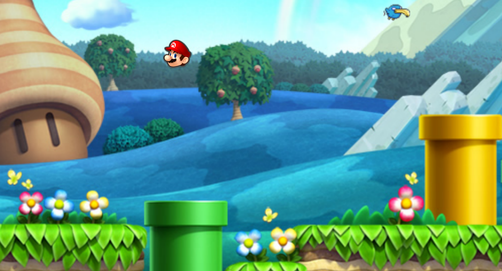

# Csfml-Video-Games-1tek

 I made a video of the game, I'm trying to connect all these sfml games together.But with the language C
 ,That would be really complicated.
 
 Anyway, (https://www.bilibili.com/video/BV1n7411f7bL#reply2637366910) -> this is the video if you willing to take a look~
 
My_runner: 
           It's is a running game, such as Subway Surfers.
           
           Players should avoid to crash on the walls or "kiss" with the monsters on the road
           
           GO and try to get your best score in 'Infinity mode'!
           
           Compilation: make
                       ./my_runner
          
           
My_Hunter: 
        It's a game based on the rules of Duck Hunt

        Commande: 
        1. Duck must appear on the screen and move from one side to another\
        2. The player can click on the duck and shoot them(Don't shoot on my Mario please)

        Compilation: make
                   ./my_hunter
        
